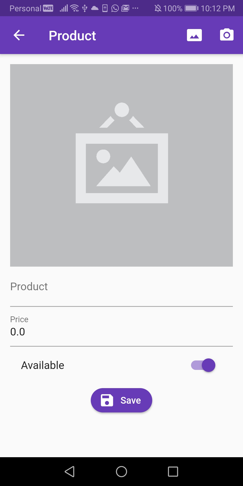
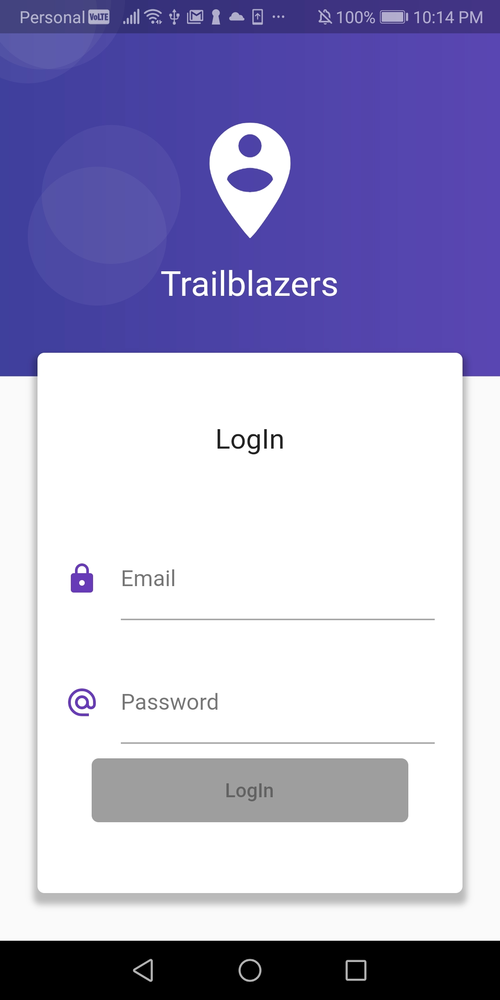
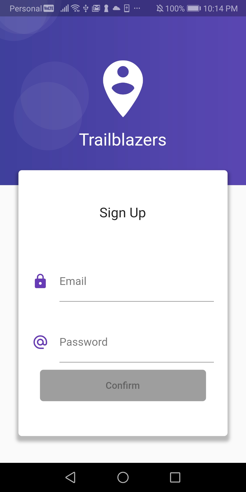

# Ecommerce App

Flutter App using REST API, Firebase, Device Image Gallery, Forms and Validations.






Run in your terminal:
```
flutter packages get
flutter run
```

Firebase
```
{
  /* Visit https://firebase.google.com/docs/database/security to learn more about security rules. */
  "rules": {
    ".read": "auth != null",
    ".write": "auth != null"
  }
}
```

[ ] Run flutter format to have all code following Dart Format Standard
[ ] Add screenshots of the app
[ ] Create app doc
[ ] Centralize all customized information like Firebase Realtime Database url